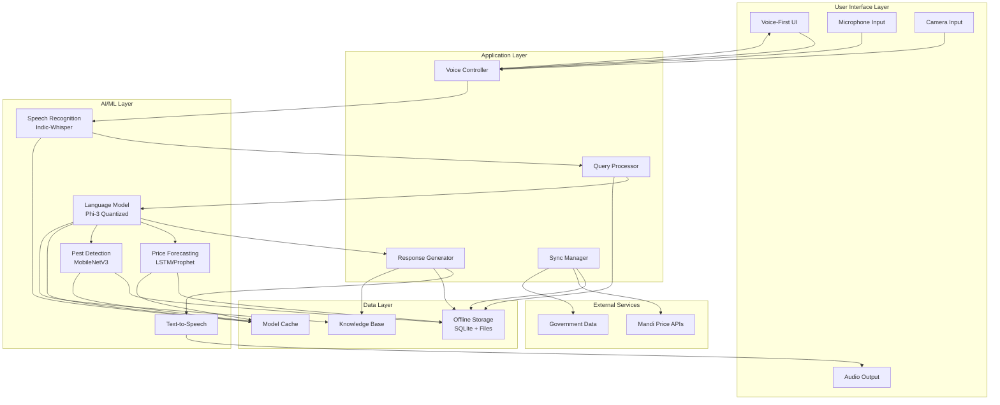

# Design Document: Krishi-Vani

## Overview

Krishi-Vani is an offline-first, voice-driven Android application that empowers rural farmers with AI-powered agricultural intelligence. The system architecture prioritizes offline operation, low resource consumption, and vernacular language support to address the unique challenges of rural India: low literacy rates, language barriers, and unreliable connectivity.

The application integrates four core AI components:
1. **Indic-Whisper** for multilingual speech recognition (Hindi, Marathi, Telugu)
2. **Quantized Phi-3 SLM** for natural language understanding and reasoning
3. **LSTM/Prophet models** for Mandi price forecasting
4. **MobileNetV3** for pest and disease detection

All models are quantized and optimized for on-device inference on budget Android devices (2GB RAM minimum). The architecture follows an offline-first pattern where all critical functionality works without connectivity, with opportunistic synchronization when network is available.

## Architecture

### High-Level Architecture



### Component Responsibilities

**Voice Controller**: Orchestrates voice interaction flow, manages microphone/speaker access, handles interruptions

**Query Processor**: Parses user intent from transcribed text, extracts entities (crop, location, date), routes to appropriate AI components

**Response Generator**: Formats responses for voice output, handles multi-turn conversations, manages context

**Sync Manager**: Handles background data synchronization, implements retry logic with exponential backoff, prioritizes critical updates

**Speech Recognition (Indic-Whisper)**: Converts vernacular speech to text, handles code-switching, filters background noise

**Language Model (Phi-3)**: Understands natural language queries, provides agricultural guidance, maintains conversation context

**Price Forecasting Engine**: Generates 7-day price predictions using time-series models, provides confidence intervals

**Pest Detection Engine**: Classifies crop diseases and pests from images, provides treatment recommendations

**Offline Storage**: SQLite database for structured data (prices, user preferences), file storage for model weights and images

**Model Cache**: In-memory cache for frequently used model weights to reduce disk I/O

**Knowledge Base**: Agricultural best practices, seasonal calendars, treatment recommendations

## Components and Interfaces

### 1. Voice Controller

**Responsibilities:**
- Manage audio input/output lifecycle
- Coordinate voice interaction flow
- Handle user interruptions
- Manage UI state transitions

**Interface:**
```typescript
interface VoiceController {
  // Start listening for voice input
  startListening(): Promise<void>
  
  // Stop listening and process input
  stopListening(): Promise<string>
  
  // Speak response to user
  speak(text: string, language: Language): Promise<void>
  
  // Stop current speech output
  stopSpeaking(): void
  
  // Check if currently speaking
  isSpeaking(): boolean
  
  // Set voice interaction language
  setLanguage(language: Language): void
}

enum Language {
  HINDI = "hi",
  MARATHI = "mr",
  TELUGU = "te"
}
```

### 2. Speech Recognition Engine (Indic-Whisper)

**Responsibilities:**
- Convert vernacular speech to text
- Handle background noise filtering
- Support code-switching (vernacular + English)
- Detect speech pauses vs. completion

**Interface:**
```typescript
interface SpeechRecognitionEngine {
  // Initialize model for specific language
  initialize(language: Language): Promise<void>
  
  // Transcribe audio buffer to text
  transcribe(audioBuffer: Float32Array): Promise<TranscriptionResult>
  
  // Check if model is ready
  isReady(): boolean
  
  // Get supported languages
  getSupportedLanguages(): Language[]
}

interface TranscriptionResult {
  text: string
  confidence: number
  language: Language
  isComplete: boolean  // true if speech appears complete
}
```

### 3. Language Model (Phi-3 Quantized)

**Responsibilities:**
- Understand natural language queries
- Extract entities (crop, location, date)
- Determine user intent
- Generate contextual responses
- Provide agricultural guidance

**Interface:**
```typescript
interface LanguageModel {
  // Initialize quantized model
  initialize(): Promise<void>
  
  // Process query and extract intent
  processQuery(query: string, context: ConversationContext): Promise<QueryIntent>
  
  // Generate response for given intent
  generateResponse(intent: QueryIntent, data: any): Promise<string>
  
  // Get agricultural guidance
  getGuidance(topic: string, context: FarmingContext): Promise<string>
}

interface QueryIntent {
  type: IntentType
  entities: {
    crop?: string
    location?: string
    dateRange?: DateRange
    disease?: string
  }
  confidence: number
}

enum IntentType {
  MANDI_PRICE_QUERY = "mandi_price",
  PRICE_FORECAST_QUERY = "price_forecast",
  PEST_DETECTION = "pest_detection",
  FARMING_GUIDANCE = "farming_guidance",
  GENERAL_QUERY = "general"
}

interface ConversationContext {
  previousIntents: QueryIntent[]
  userPreferences: UserPreferences
  sessionId: string
}

interface FarmingContext {
  region: string
  season: string
  cropType?: string
}
```

### 4. Price Forecasting Engine

**Responsibilities:**
- Generate 7-day price forecasts
- Provide confidence intervals
- Retrain models with updated data
- Handle multiple crops and locations

**Interface:**
```typescript
interface PriceForecastingEngine {
  // Initialize forecasting models
  initialize(): Promise<void>
  
  // Generate price forecast
  forecast(crop: string, location: string, days: number): Promise<PriceForecast>
  
  // Get current price
  getCurrentPrice(crop: string, location: string): Promise<PricePoint | null>
  
  // Retrain model with new data
  retrain(historicalData: PriceHistory[]): Promise<void>
  
  // Check if retraining is needed
  needsRetraining(): boolean
}

interface PriceForecast {
  crop: string
  location: string
  predictions: PricePrediction[]
  modelAccuracy: number
  lastUpdated: Date
}

interface PricePrediction {
  date: Date
  predictedPrice: number
  confidenceInterval: {
    lower: number
    upper: number
  }
  confidence: number
}

interface PricePoint {
  crop: string
  location: string
  price: number
  unit: string  // "per quintal", "per kg"
  date: Date
  source: string
}
```

### 5. Pest Detection Engine

**Responsibilities:**
- Classify crop diseases and pests from images
- Provide confidence scores
- Recommend treatments
- Guide image capture for quality

**Interface:**
```typescript
interface PestDetectionEngine {
  // Initialize MobileNetV3 model
  initialize(): Promise<void>
  
  // Detect pests/diseases from image
  detect(image: ImageData): Promise<DetectionResult>
  
  // Validate image quality
  validateImageQuality(image: ImageData): ImageQualityResult
  
  // Get treatment recommendations
  getTreatment(detectionId: string): Promise<TreatmentRecommendation>
}

interface DetectionResult {
  detections: Detection[]
  imageQuality: number
  processingTime: number
}

interface Detection {
  id: string
  name: string
  type: "pest" | "disease" | "nutrient_deficiency"
  confidence: number
  affectedArea: BoundingBox
  severity: "low" | "medium" | "high"
}

interface BoundingBox {
  x: number
  y: number
  width: number
  height: number
}

interface ImageQualityResult {
  isAcceptable: boolean
  issues: string[]  // "too_dark", "too_blurry", "wrong_angle"
  suggestions: string[]
}

interface TreatmentRecommendation {
  detectionName: string
  treatments: Treatment[]
  preventiveMeasures: string[]
  estimatedCost: number
}

interface Treatment {
  name: string
  description: string
  application: string
  timing: string
  dosage: string
}
```

### 6. Offline Storage

**Responsibilities:**
- Store Mandi price data (current + historical)
- Cache model weights and configurations
- Store user preferences and history
- Manage agricultural knowledge base
- Handle data archival and cleanup

**Interface:**
```typescript
interface OfflineStorage {
  // Price data operations
  savePrices(prices: PricePoint[]): Promise<void>
  getPrices(crop: string, location: string, dateRange: DateRange): Promise<PricePoint[]>
  getHistoricalPrices(crop: string, location: string, days: number): Promise<PricePoint[]>
  
  // User data operations
  saveUserPreferences(prefs: UserPreferences): Promise<void>
  getUserPreferences(): Promise<UserPreferences>
  saveQueryHistory(query: QueryHistory): Promise<void>
  getQueryHistory(limit: number): Promise<QueryHistory[]>
  
  // Knowledge base operations
  getGuidance(topic: string, filters: any): Promise<GuidanceEntry[]>
  searchKnowledgeBase(query: string): Promise<KnowledgeEntry[]>
  
  // Model cache operations
  saveModelWeights(modelId: string, weights: ArrayBuffer): Promise<void>
  getModelWeights(modelId: string): Promise<ArrayBuffer | null>
  
  // Storage management
  getStorageUsage(): Promise<StorageStats>
  cleanupOldData(retentionDays: number): Promise<void>
}

interface UserPreferences {
  language: Language
  region: string
  primaryCrops: string[]
  notificationsEnabled: boolean
}

interface QueryHistory {
  timestamp: Date
  query: string
  intent: IntentType
  responseTime: number
}

interface StorageStats {
  totalSize: number
  priceDataSize: number
  modelCacheSize: number
  knowledgeBaseSize: number
  availableSpace: number
}
```

### 7. Sync Manager

**Responsibilities:**
- Detect network connectivity
- Synchronize Mandi price data
- Download model updates
- Upload analytics (with user consent)
- Implement retry logic with exponential backoff
- Prioritize critical updates

**Interface:**
```typescript
interface SyncManager {
  // Start background sync
  startSync(): Promise<void>
  
  // Force immediate sync
  forceSyncNow(): Promise<SyncResult>
  
  // Check sync status
  getSyncStatus(): SyncStatus
  
  // Get last sync time
  getLastSyncTime(): Date | null
  
  // Configure sync settings
  configureSyncSettings(settings: SyncSettings): void
  
  // Register sync listener
  onSyncComplete(callback: (result: SyncResult) => void): void
}

interface SyncResult {
  success: boolean
  pricesUpdated: number
  modelsUpdated: string[]
  errors: SyncError[]
  timestamp: Date
  bytesTransferred: number
}

interface SyncStatus {
  isRunning: boolean
  progress: number  // 0-100
  currentTask: string
  lastSync: Date | null
}

interface SyncSettings {
  autoSync: boolean
  syncOnWifiOnly: boolean
  syncInterval: number  // minutes
  maxRetries: number
}

interface SyncError {
  type: "network" | "server" | "storage"
  message: string
  retryable: boolean
}
```

### 8. Text-to-Speech Engine

**Responsibilities:**
- Convert text to natural speech
- Support vernacular languages
- Format numbers according to local conventions
- Handle interruptions

**Interface:**
```typescript
interface TextToSpeechEngine {
  // Initialize TTS for language
  initialize(language: Language): Promise<void>
  
  // Speak text
  speak(text: string, options: SpeechOptions): Promise<void>
  
  // Stop current speech
  stop(): void
  
  // Check if speaking
  isSpeaking(): boolean
  
  // Get available voices
  getAvailableVoices(language: Language): Voice[]
}

interface SpeechOptions {
  rate: number  // 0.5 - 2.0
  pitch: number  // 0.5 - 2.0
  voice?: Voice
}

interface Voice {
  id: string
  name: string
  language: Language
  gender: "male" | "female"
}
```

## Data Models

### Price Data Model

```typescript
interface PriceData {
  id: string
  crop: string
  cropVariety?: string
  location: string
  state: string
  district: string
  market: string
  price: number
  unit: "quintal" | "kg"
  currency: "INR"
  date: Date
  source: string
  quality?: "A" | "B" | "C"
  minPrice?: number
  maxPrice?: number
  modalPrice: number
  arrivals?: number  // quantity arrived at market
  createdAt: Date
  updatedAt: Date
}

// Time-series data for forecasting
interface PriceTimeSeries {
  crop: string
  location: string
  dataPoints: TimeSeriesPoint[]
  frequency: "daily" | "weekly"
}

interface TimeSeriesPoint {
  timestamp: Date
  price: number
  volume?: number
}
```

### Detection Data Model

```typescript
interface DetectionRecord {
  id: string
  userId: string
  imageUri: string
  detections: Detection[]
  timestamp: Date
  location?: GeoLocation
  cropType?: string
  farmId?: string
  actionTaken?: string
  resolved: boolean
}

interface GeoLocation {
  latitude: number
  longitude: number
  accuracy: number
}
```

### User Data Model

```typescript
interface UserProfile {
  id: string
  name?: string
  phoneNumber?: string
  language: Language
  region: string
  state: string
  district: string
  primaryCrops: string[]
  farmSize?: number  // in acres
  createdAt: Date
  lastActive: Date
  preferences: UserPreferences
}

interface UserSession {
  sessionId: string
  userId: string
  startTime: Date
  endTime?: Date
  queries: QueryHistory[]
  language: Language
}
```

### Knowledge Base Model

```typescript
interface GuidanceEntry {
  id: string
  topic: string
  category: "planting" | "irrigation" | "fertilization" | "pest_control" | "harvesting"
  crop?: string
  season?: string
  region?: string
  content: string
  audioUri?: string  // pre-recorded audio guidance
  imageUris: string[]
  tags: string[]
  language: Language
  priority: number
}

interface TreatmentEntry {
  id: string
  pestOrDisease: string
  type: "pest" | "disease" | "nutrient_deficiency"
  symptoms: string[]
  treatments: Treatment[]
  preventiveMeasures: string[]
  organicOptions: Treatment[]
  chemicalOptions: Treatment[]
  estimatedCost: CostRange
  effectiveness: number  // 0-100
}

interface CostRange {
  min: number
  max: number
  currency: "INR"
  unit: "per acre" | "per application"
}
```

### Model Metadata

```typescript
interface ModelMetadata {
  modelId: string
  modelType: "speech_recognition" | "language_model" | "forecasting" | "pest_detection"
  version: string
  language?: Language
  sizeBytes: number
  quantization: "int8" | "int4" | "fp16"
  accuracy: number
  lastUpdated: Date
  downloadUrl: string
  checksum: string
  requiredAndroidVersion: string
  requiredRAM: number  // MB
}
```

## Correctness Properties

*A property is a characteristic or behavior that should hold true across all valid executions of a system—essentially, a formal statement about what the system should do. Properties serve as the bridge between human-readable specifications and machine-verifiable correctness guarantees.*


### Core Functionality Properties

**Property 1: Multi-language speech recognition**
*For any* audio input in Hindi, Marathi, or Telugu, the Speech Recognition Engine should produce a transcription with confidence score, and the transcription quality should be sufficient for query understanding.
**Validates: Requirements 1.1**

**Property 2: Speech pause handling**
*For any* audio input containing pauses below a threshold duration, the Speech Recognition Engine should wait for continuation rather than immediately processing the incomplete input.
**Validates: Requirements 1.3**

**Property 3: Entity extraction from natural language**
*For any* natural language query about Mandi prices containing crop type, location, and time period information, the Language Model should correctly extract all present entities with their values.
**Validates: Requirements 2.1**

**Property 4: Intent classification accuracy**
*For any* user query, the Language Model should classify it into exactly one intent type (mandi_price, price_forecast, pest_detection, farming_guidance, or general) with a confidence score.
**Validates: Requirements 2.2**

**Property 5: Ambiguous query handling**
*For any* query that lacks required entities for its intent type, the Language Model should generate a clarifying question to obtain the missing information.
**Validates: Requirements 2.5**

**Property 6: Most recent price retrieval**
*For any* crop and location combination with stored price data, querying current prices should return the price entry with the most recent date.
**Validates: Requirements 3.1**

**Property 7: Seven-day forecast generation**
*For any* crop and location with at least 90 days of historical price data, the Price Forecasting Engine should generate exactly 7 daily price predictions.
**Validates: Requirements 3.2**

**Property 8: Historical data retention**
*For any* crop and location, querying historical prices should return at least 90 days of data points (or all available data if less than 90 days have been collected).
**Validates: Requirements 3.4**

**Property 9: Price formatting consistency**
*For any* price data displayed to users, the formatted output should contain the currency (INR) and an appropriate unit (per quintal or per kg).
**Validates: Requirements 3.5**

**Property 10: Confidence intervals in forecasts**
*For any* price forecast generated, each prediction should include a confidence interval with both lower and upper bounds.
**Validates: Requirements 4.2**

**Property 11: Forecast accuracy monitoring**
*For any* forecast where actual prices become available, if the accuracy metric falls below the acceptable threshold, a notification should be generated for the user.
**Validates: Requirements 4.5**

**Property 12: Pest detection from images**
*For any* valid crop image input, the Pest Detection Engine should produce a detection result containing zero or more detections, each with a confidence score.
**Validates: Requirements 5.1, 5.2**

**Property 13: Treatment recommendations for detections**
*For any* identified pest or disease with confidence above threshold, the system should provide at least one treatment recommendation with application details.
**Validates: Requirements 5.3**

### Offline-First Properties

**Property 14: Comprehensive offline operation**
*For any* core operation (speech recognition, query understanding, price retrieval, pest detection, voice output) performed with network connectivity disabled, the operation should complete successfully using locally stored models and data.
**Validates: Requirements 1.4, 2.4, 4.4, 5.4, 6.1, 8.4**

**Property 15: Automatic sync on connectivity**
*For any* transition from disconnected to connected network state, the Sync Manager should automatically initiate a synchronization operation within a reasonable time window.
**Validates: Requirements 3.3, 6.3, 7.1**

**Property 16: Sync priority ordering**
*For any* synchronization operation with both critical updates (recent Mandi prices) and non-critical updates (historical data) pending, critical updates should be processed before non-critical updates.
**Validates: Requirements 6.4**

**Property 17: Data download and storage**
*For any* successful data synchronization, newly downloaded price data should be queryable from Offline Storage immediately after sync completion.
**Validates: Requirements 7.2**

**Property 18: Sync retry with exponential backoff**
*For any* synchronization failure due to connectivity loss, subsequent retry attempts should occur with exponentially increasing delays until success or maximum retries reached.
**Validates: Requirements 7.3**

**Property 19: Data compression in transit**
*For any* data transfer during synchronization, the transmitted payload size should be smaller than the uncompressed data size, indicating compression is applied.
**Validates: Requirements 7.4**

**Property 20: Sync timestamp updates**
*For any* successful synchronization operation, the last sync timestamp should be updated to the completion time and be visible to the user.
**Validates: Requirements 7.5**

### Voice Output Properties

**Property 21: Text-to-speech in selected language**
*For any* response text and user-selected language (Hindi, Marathi, or Telugu), the Voice Output Engine should generate audio output in the selected language.
**Validates: Requirements 8.1**

**Property 22: Numerical data formatting in speech**
*For any* response containing numerical data (prices, dates, quantities), the spoken output should format numbers according to local conventions for the selected language.
**Validates: Requirements 8.3**

**Property 23: Voice output interruption**
*For any* voice output in progress, when a user interruption is detected, the Voice Output Engine should stop speaking within 500ms and transition to listening mode.
**Validates: Requirements 8.5**

### Multi-Language Properties

**Property 24: Language change propagation**
*For any* language preference change, all subsequent voice input processing, voice output, and UI text should use the newly selected language.
**Validates: Requirements 9.2**

**Property 25: Code-switching support**
*For any* audio input containing mixed English and vernacular language words, the Speech Recognition Engine should transcribe both language portions correctly.
**Validates: Requirements 9.3**

### Performance and Resource Properties

**Property 26: Model storage footprint**
*For all* model weights stored locally (speech recognition, language model, forecasting, pest detection), the total storage size should not exceed 500MB.
**Validates: Requirements 10.2**

**Property 27: Operation latency bounds**
*For any* user-initiated operation (voice transcription, query processing, price lookup, pest detection), the operation should complete within 3 seconds on minimum-spec devices (2GB RAM, Android 8.0).
**Validates: Requirements 10.3**

**Property 28: Low battery power conservation**
*For any* device state where battery level is below 15%, background processing operations (sync, model retraining) should be paused or reduced.
**Validates: Requirements 10.5**

**Property 29: Minimum font size compliance**
*For any* text displayed in the UI, the font size should be at least 18sp to ensure readability.
**Validates: Requirements 11.2**

**Property 30: Voice-guided navigation**
*For any* navigation action available in the UI, voice guidance describing the action should be available when requested.
**Validates: Requirements 11.4**

### Security and Privacy Properties

**Property 31: User data encryption at rest**
*For any* user data stored in Offline Storage (preferences, query history, personal information), the data should be encrypted using a secure encryption algorithm.
**Validates: Requirements 12.1**

**Property 32: Secure sync connections**
*For any* data synchronization operation, all network connections should use HTTPS protocol with valid SSL/TLS certificate validation.
**Validates: Requirements 12.2**

**Property 33: PII transmission requires consent**
*For any* personally identifiable information, transmission to external servers should only occur if explicit user consent has been granted.
**Validates: Requirements 12.3**

**Property 34: Local voice processing**
*For any* voice recording captured for speech recognition, the audio data should be processed locally and should not be transmitted over the network.
**Validates: Requirements 12.4**

### Knowledge Base Properties

**Property 35: Knowledge base completeness**
*For any* query to the knowledge base for agricultural guidance, the system should return entries covering the major categories: planting, irrigation, fertilization, pest control, and harvesting.
**Validates: Requirements 13.2**

**Property 36: Visual guidance availability**
*For any* agricultural guidance that requires visual demonstration, the response should include diagram URIs or image references along with voice narration.
**Validates: Requirements 13.5**

### Error Handling Properties

**Property 37: Voice feedback on recognition errors**
*For any* speech recognition error or failure, the system should provide voice feedback to the user requesting them to repeat their query.
**Validates: Requirements 14.1**

**Property 38: Graceful inference failure handling**
*For any* model inference failure (language model, forecasting, pest detection), the application should log the error and continue running without crashing.
**Validates: Requirements 14.2**

**Property 39: Data corruption recovery**
*For any* detected data corruption in Offline Storage, the system should attempt to restore from backup or mark data for re-synchronization when connectivity is available.
**Validates: Requirements 14.3**

**Property 40: Unrecoverable error messaging**
*For any* unrecoverable error, the system should display a simple error message and provide voice output with basic troubleshooting suggestions.
**Validates: Requirements 14.4**

**Property 41: Privacy-respecting error logs**
*For any* error logged by the system, the log entry should not contain personally identifiable information.
**Validates: Requirements 14.5**

### Analytics and Monitoring Properties

**Property 42: Comprehensive metrics collection**
*For any* user interaction (query, feature usage, model inference), anonymous usage metrics including operation type, duration, and outcome should be collected locally.
**Validates: Requirements 15.1, 15.3**

**Property 43: Analytics transmission on connectivity**
*For any* network connectivity event with pending analytics data, the Sync Manager should transmit aggregated analytics to monitoring systems.
**Validates: Requirements 15.2**

**Property 44: Performance degradation alerts**
*For any* performance metric (inference time, accuracy, error rate) that falls below acceptable thresholds, an alert should be generated for system administrators.
**Validates: Requirements 15.4**

**Property 45: Analytics opt-out respect**
*For any* user who has opted out of analytics collection, no usage metrics should be collected or transmitted for that user's sessions.
**Validates: Requirements 15.5**

## Error Handling

### Error Categories

**1. Speech Recognition Errors**
- Ambient noise too high for accurate transcription
- Audio input too quiet or distorted
- Unsupported language or dialect
- Microphone permission denied

**Handling Strategy:**
- Provide voice feedback: "I couldn't hear you clearly. Please try again in a quieter place."
- Offer visual feedback with microphone level indicator
- Request microphone permissions with clear explanation
- Fallback to text input if repeated failures occur

**2. Language Model Errors**
- Query too ambiguous to extract intent
- Required entities missing from query
- Model inference timeout or failure
- Out-of-vocabulary terms

**Handling Strategy:**
- Ask clarifying questions: "Which crop would you like to know prices for?"
- Provide examples of valid queries
- Log inference failures for model improvement
- Gracefully degrade to simpler response generation

**3. Data Availability Errors**
- Requested price data not available in offline storage
- Historical data insufficient for forecasting
- Knowledge base entry not found
- Model weights missing or corrupted

**Handling Strategy:**
- Inform user: "I don't have recent prices for that crop. I'll update when you're connected to internet."
- Suggest alternative queries with available data
- Offer to notify user when data becomes available
- Attempt re-download of corrupted models on next sync

**4. Pest Detection Errors**
- Image quality too poor for analysis
- No crop visible in image
- Lighting conditions inadequate
- Camera permission denied

**Handling Strategy:**
- Provide voice-guided image capture instructions
- Show example images of good quality captures
- Suggest optimal lighting and distance
- Allow multiple capture attempts with feedback

**5. Synchronization Errors**
- Network timeout during data download
- Server unavailable or returning errors
- Authentication failure
- Insufficient storage space for updates

**Handling Strategy:**
- Implement exponential backoff retry (1s, 2s, 4s, 8s, 16s, max 60s)
- Queue failed operations for retry
- Notify user of sync failures with simple explanation
- Provide manual retry option
- Clear old data if storage is full

**6. Resource Constraint Errors**
- Insufficient memory for model loading
- Battery too low for intensive operations
- Storage space critically low
- Device overheating

**Handling Strategy:**
- Unload unused models from memory
- Defer non-critical operations when battery < 15%
- Prompt user to free storage space
- Throttle inference frequency if device is hot

### Error Recovery Patterns

**Retry with Backoff:**
```typescript
async function retryWithBackoff<T>(
  operation: () => Promise<T>,
  maxRetries: number = 5,
  baseDelay: number = 1000
): Promise<T> {
  for (let attempt = 0; attempt < maxRetries; attempt++) {
    try {
      return await operation()
    } catch (error) {
      if (attempt === maxRetries - 1) throw error
      const delay = baseDelay * Math.pow(2, attempt)
      await sleep(Math.min(delay, 60000))  // cap at 60s
    }
  }
  throw new Error("Max retries exceeded")
}
```

**Graceful Degradation:**
```typescript
async function getPrice(crop: string, location: string): Promise<PriceInfo> {
  try {
    // Try to get latest price
    return await offlineStorage.getCurrentPrice(crop, location)
  } catch (error) {
    // Fallback to last known price
    const historical = await offlineStorage.getHistoricalPrices(crop, location, 7)
    if (historical.length > 0) {
      return {
        ...historical[0],
        isStale: true,
        message: "This is the last known price. Connect to internet for latest updates."
      }
    }
    throw new Error("No price data available")
  }
}
```

**Circuit Breaker:**
```typescript
class CircuitBreaker {
  private failures = 0
  private lastFailureTime = 0
  private readonly threshold = 5
  private readonly timeout = 60000  // 1 minute
  
  async execute<T>(operation: () => Promise<T>): Promise<T> {
    if (this.isOpen()) {
      throw new Error("Circuit breaker is open")
    }
    
    try {
      const result = await operation()
      this.onSuccess()
      return result
    } catch (error) {
      this.onFailure()
      throw error
    }
  }
  
  private isOpen(): boolean {
    if (this.failures >= this.threshold) {
      const timeSinceLastFailure = Date.now() - this.lastFailureTime
      return timeSinceLastFailure < this.timeout
    }
    return false
  }
  
  private onSuccess(): void {
    this.failures = 0
  }
  
  private onFailure(): void {
    this.failures++
    this.lastFailureTime = Date.now()
  }
}
```

## Testing Strategy

### Dual Testing Approach

The testing strategy employs both unit tests and property-based tests to ensure comprehensive coverage:

**Unit Tests** focus on:
- Specific examples demonstrating correct behavior
- Edge cases (empty inputs, boundary values, malformed data)
- Error conditions and exception handling
- Integration points between components
- UI behavior and user interactions

**Property-Based Tests** focus on:
- Universal properties that hold for all valid inputs
- Comprehensive input coverage through randomization
- Invariants that must be maintained across operations
- Round-trip properties (serialize/deserialize, encode/decode)
- Metamorphic properties (relationships between operations)

Both approaches are complementary and necessary. Unit tests catch concrete bugs and validate specific scenarios, while property tests verify general correctness across a wide input space.

### Property-Based Testing Configuration

**Framework Selection:**
- **Android/Kotlin**: Use [Kotest Property Testing](https://kotest.io/docs/proptest/property-based-testing.html)
- **Alternative**: [junit-quickcheck](https://pholser.github.io/junit-quickcheck/) for Java-based tests

**Configuration Requirements:**
- Minimum 100 iterations per property test (due to randomization)
- Each property test must reference its design document property
- Tag format: `@Tag("Feature: krishi-vani, Property {number}: {property_text}")`
- Use appropriate generators for domain types (crops, locations, prices, dates)

**Example Property Test Structure:**
```kotlin
@Tag("Feature: krishi-vani, Property 1: Multi-language speech recognition")
class SpeechRecognitionPropertyTest : StringSpec({
    "speech recognition produces transcriptions for all supported languages" {
        checkAll(100, Arb.audioSample(), Arb.language()) { audio, language ->
            val engine = SpeechRecognitionEngine()
            engine.initialize(language)
            
            val result = engine.transcribe(audio)
            
            result.text shouldNotBe ""
            result.confidence shouldBeGreaterThan 0.0
            result.language shouldBe language
        }
    }
})
```

### Test Categories

**1. Speech Recognition Tests**
- Unit: Test specific phrases in each language
- Unit: Test with various background noise levels
- Property: For any audio in supported languages, produce valid transcription (Property 1)
- Property: For any audio with pauses, wait for continuation (Property 2)
- Edge: Handle extremely noisy environments
- Edge: Handle very quiet or distorted audio

**2. Language Model Tests**
- Unit: Test entity extraction for known query patterns
- Unit: Test intent classification for each intent type
- Property: For any price query, extract all present entities (Property 3)
- Property: For any query, classify to exactly one intent (Property 4)
- Property: For any ambiguous query, generate clarifying question (Property 5)
- Edge: Handle queries with typos or grammatical errors
- Edge: Handle very long or very short queries

**3. Price Data Tests**
- Unit: Test price retrieval for specific crops and locations
- Unit: Test forecast generation with known historical data
- Property: For any crop/location, return most recent price (Property 6)
- Property: For any crop with 90+ days data, generate 7-day forecast (Property 7)
- Property: For any forecast, include confidence intervals (Property 10)
- Edge: Handle missing price data
- Edge: Handle gaps in historical data

**4. Pest Detection Tests**
- Unit: Test detection with known pest images
- Unit: Test image quality validation
- Property: For any valid image, produce detection result (Property 12)
- Property: For any detection, provide treatment recommendations (Property 13)
- Edge: Handle poor quality images
- Edge: Handle images with no crops visible

**5. Offline Operation Tests**
- Unit: Test each component individually offline
- Property: For any core operation offline, complete successfully (Property 14)
- Property: For any network transition, trigger sync (Property 15)
- Edge: Handle network interruptions during operations
- Edge: Handle storage full scenarios

**6. Synchronization Tests**
- Unit: Test sync with mock server responses
- Unit: Test retry logic with simulated failures
- Property: For any sync, download and store new data (Property 17)
- Property: For any sync failure, retry with exponential backoff (Property 18)
- Property: For any sync, compress data in transit (Property 19)
- Edge: Handle partial sync failures
- Edge: Handle corrupted downloaded data

**7. Voice Output Tests**
- Unit: Test TTS for specific phrases in each language
- Unit: Test number formatting for various locales
- Property: For any text, generate audio in selected language (Property 21)
- Property: For any numerical data, format according to locale (Property 22)
- Property: For any interruption, stop within 500ms (Property 23)

**8. Multi-Language Tests**
- Unit: Test language switching for each supported language
- Property: For any language change, update all components (Property 24)
- Property: For any mixed-language input, transcribe correctly (Property 25)
- Edge: Handle rapid language switching

**9. Performance Tests**
- Unit: Measure model loading times
- Unit: Measure inference latency for typical inputs
- Property: For all models, total size ≤ 500MB (Property 26)
- Property: For any operation, complete within 3s (Property 27)
- Property: For low battery, reduce background processing (Property 28)

**10. Security Tests**
- Unit: Verify encryption of specific data types
- Unit: Test HTTPS certificate validation
- Property: For any user data, encrypt at rest (Property 31)
- Property: For any sync, use HTTPS (Property 32)
- Property: For any PII, require consent before transmission (Property 33)
- Property: For any voice recording, process locally (Property 34)

**11. Error Handling Tests**
- Unit: Test specific error scenarios
- Unit: Test error message generation
- Property: For any recognition error, provide voice feedback (Property 37)
- Property: For any inference failure, don't crash (Property 38)
- Property: For any corruption, attempt recovery (Property 39)
- Property: For any error, log without PII (Property 41)

**12. Analytics Tests**
- Unit: Test metrics collection for specific events
- Unit: Test opt-out functionality
- Property: For any interaction, collect metrics (Property 42)
- Property: For any connectivity with pending analytics, transmit (Property 43)
- Property: For any opt-out user, don't collect metrics (Property 45)

### Integration Testing

**End-to-End Flows:**
1. Voice query → Speech recognition → Intent extraction → Price lookup → Voice response
2. Image capture → Quality validation → Pest detection → Treatment recommendation → Voice output
3. Network available → Sync trigger → Data download → Storage update → Timestamp update
4. Language change → Update all components → Verify consistency across UI and voice

**Performance Benchmarks:**
- Speech recognition: < 1s for 5-second audio clip
- Intent extraction: < 500ms for typical query
- Price lookup: < 100ms from local storage
- Pest detection: < 2s for 1080p image
- Forecast generation: < 1s for 7-day prediction
- Full sync: < 30s on 3G connection

### Test Data Requirements

**Generators for Property Tests:**
- Audio samples in Hindi, Marathi, Telugu (with varying quality, noise levels)
- Natural language queries (with and without entities, various intents)
- Price data (various crops, locations, date ranges)
- Crop images (various pests, diseases, quality levels)
- Network conditions (connected, disconnected, slow, intermittent)
- Device states (battery levels, storage availability, memory pressure)

**Mock Data:**
- Historical price data for 20+ common crops across 10+ locations
- Knowledge base entries covering all guidance categories
- Pest/disease database with 50+ entries
- Treatment recommendations for common agricultural issues

### Continuous Testing

**Pre-commit Hooks:**
- Run unit tests for modified components
- Run linting and code formatting checks
- Verify no PII in test data or logs

**CI/CD Pipeline:**
- Run full unit test suite
- Run property tests with 100 iterations
- Run integration tests on emulator
- Performance benchmarking on minimum-spec device profile
- Security scanning for vulnerabilities
- APK size verification (< 50MB)

**Device Testing:**
- Test on minimum-spec device (2GB RAM, Android 8.0)
- Test on mid-range device (4GB RAM, Android 11)
- Test on various screen sizes (4.5" to 6.5")
- Test with different Android versions (8.0, 9.0, 10, 11, 12, 13)
- Test with actual farmers for usability validation
